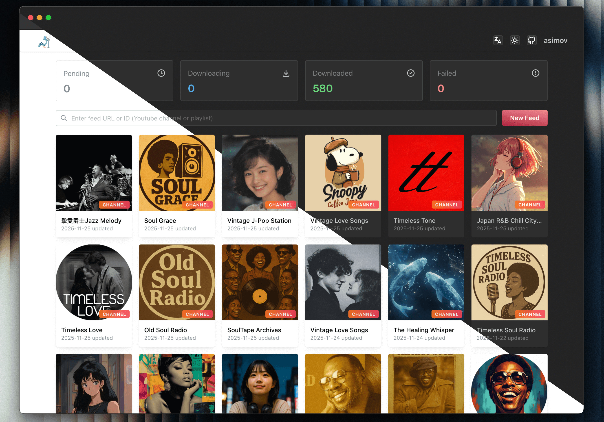
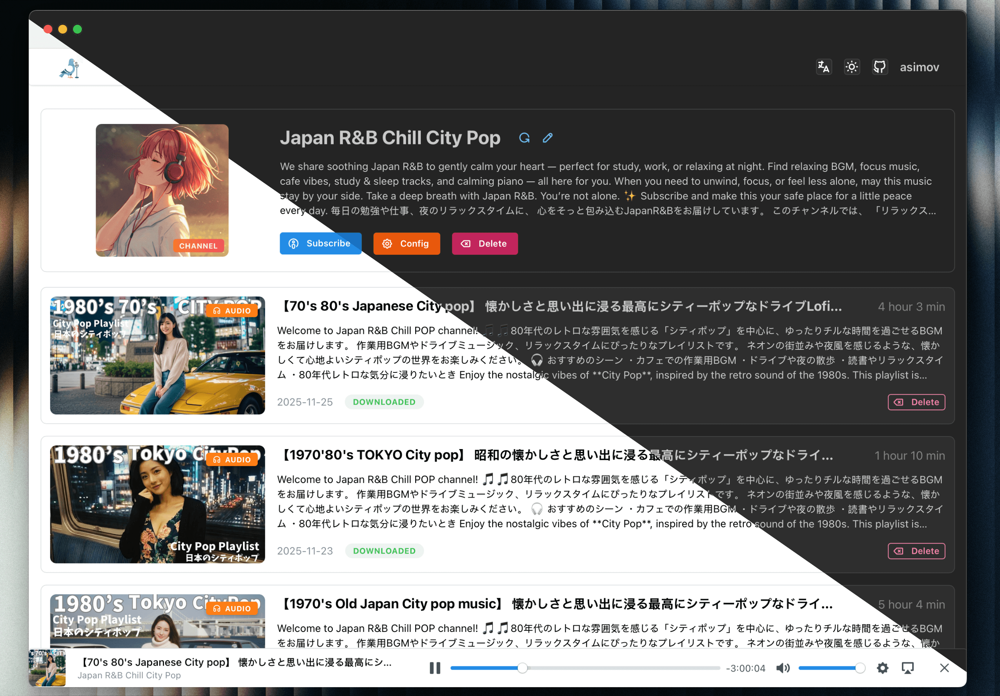

<div align="center">
  
  <h2>Listen to YouTube, Anywhere, Anytime.</h2>
</div>

<div align="center">

  [简体中文](README-ZH.md)
</div>

## Screenshots


<div align="center">
  <p style="color: gray">Channel list</p>
</div>


<div align="center">
  <p style="color: gray">Channel detail</p>
</div>

## Core Features

- **🎯 Smart Subscription & Preview**: Subscribe to YouTube channels and playlists in seconds.
- **🎞 Single-video subscriptions**: Turn one YouTube video into an auto-generated playlist feed.
- **📻 Secure RSS for Any Client**: Generate protected standard RSS feeds for any podcast app.
- **🎦 Flexible Audio/Video Output**: Download as audio or video with quality and format control.
- **🤖 Auto Sync & History Backfill**: Keep subscriptions updated and backfill older videos on demand.
- **👥 Multi-user & Role-based Access**: Manage multiple accounts with granular permissions, restricting system and feed configurations to admin users.
- **🍪 Cookie Support**: Use YouTube cookies for more reliable restricted-content access.
- **🌍 Proxy-ready Network Access**: Route YouTube API and yt-dlp traffic through custom proxies.
- **🔗 One-click Episode Sharing**: Share any episode with a public page for direct playback without login.
- **📦 Fast Batch Downloads**: Search, select, and queue large back catalogs efficiently.
- **📊 Download Dashboard & Bulk Actions**: Track task status and retry, cancel, or delete in bulk.
- **🔔 Failed-download Digests & Alerts**: Get email or webhook summaries when automatic retries are exhausted.
- **🔍 Per-feed Filters & Retention**: Control sync scope with keywords, duration, and episode limits.
- **⏱ Smarter New Episode Downloads**: Delay auto-downloads to improve fresh-video processing results.
- **🎛 Customizable Feeds & Player**: Customize titles and cover art, then play episodes on the web.
- **🧩 Episode Management & Control**: Download, retry, cancel, and delete episodes with file cleanup.
- **🔓 Trusted-environment Auto Login**: Skip manual sign-in when PigeonPod runs behind trusted access controls.
- **🔒 Built-in SSL/TLS Encryption**: Secure your self-hosted instance with native SSL support for encrypted web and RSS traffic.
- **📈 YouTube API Usage Insights**: Monitor quota usage before sync jobs hit the limit.
- **🔄 OPML Subscription Export**: Export subscriptions for easy migration between podcast clients.
- **⬆️ In-app yt-dlp Management**: Manage runtimes, switch active versions, and update yt-dlp without leaving the app.
- **🛠 Advanced yt-dlp Arguments**: Fine-tune downloads with custom yt-dlp arguments.
- **📚 Podcasting 2.0 Chapters Support**: Generate chapter files for richer player navigation.
- **🌐 Multilingual Responsive UI**: Use PigeonPod across devices in eight interface languages.

## Deployment

### Using Docker Compose (Recommended)

**Make sure you have Docker and Docker Compose installed on your machine.**

1. Use the docker-compose configuration file, modify environment variables according to your needs
```yml
services:
  pigeon-pod:
    build: .
    image: 'pigeon-pod:latest'
    restart: unless-stopped
    container_name: pigeon-pod
    ports:
      - '8834:8080'
    environment:
      - SPRING_DATASOURCE_URL=jdbc:sqlite:/data/pigeon-pod.db # set to your database path
      # Optional: disable PigeonPod built-in auth when running behind another auth layer
      # - PIGEON_AUTH_ENABLED=false
    volumes:
      - data:/data

volumes:
  data:
```

> [!WARNING]
> `PIGEON_AUTH_ENABLED` defaults to `true`. Set it to `false` only if another trusted layer already protects the web UI, such as an auth proxy, reverse proxy access control, VPN, or private network.
>
> If you disable built-in auth, you must secure PigeonPod by other means. Do not expose an auth-disabled instance directly to the public Internet.

2. Start the service
```bash
docker-compose up -d
```

3. Access the application
Open your browser and visit `http://localhost:8834` with **default username: `root` and default password: `Root@123`**

### Run with JAR

**Make sure you have Java 17+ and yt-dlp installed on your machine.**

1. Build the JAR from source, see [Local Development](#local-development)

2. Create data directory in the same directory as the JAR file.
```bash
mkdir -p data
```

3. Run the application
```bash
java -jar -Dspring.datasource.url=jdbc:sqlite:/path/to/your/pigeon-pod.db \  # set to your database path
           pigeon-pod-x.x.x.jar
```

4. Access the application
Open your browser and visit `http://localhost:8080` with **default username: `root` and default password: `Root@123`**


## Storage Configuration

- PigeonPod supports `LOCAL` and `S3` storage modes.
- You can only enable one mode at a time.
- S3 mode supports MinIO, Cloudflare R2, AWS S3, and other S3-compatible services.
- Switching storage mode does not migrate historical media automatically. You must migrate files manually.

### Storage Quick Comparison

| Mode | Pros | Cons |
| --- | --- | --- |
| `LOCAL` | Easy setup, no external dependency | Uses local disk, harder to scale |
| `S3` | Better scalability, suitable for cloud deployment | Requires object storage setup and credentials |


## Documentation

Design and architecture documents live in `dev-docs/`.


## Tech Stack

### Backend
- **Java 17** - Core language
- **Spring Boot 3.5** - Application framework
- **MyBatis-Plus 3.5** - ORM framework
- **Sa-Token** - Authentication framework
- **SQLite** - Lightweight database
- **Flyway** - Database migration tool
- **YouTube Data API v3** - YouTube data retrieval
- **yt-dlp** - Video download tool
- **Rome** - RSS generation library

### Frontend
- **Javascript (ES2024)** - Core language
- **React 19** - Application framework
- **Vite 7** - Build tool
- **Mantine 8** - UI component library
- **i18next** - Internationalization support
- **Axios** - HTTP client

## Development Guide

### Environment Requirements
- Java 17+
- Node.js 22+
- Maven 3.9+
- SQLite
- yt-dlp

### Local Development

1. Enter the project directory
```bash
cd pigeon-pod
```

2. Configure database
```bash
# Create data directory
mkdir -p data/audio

# Database file will be created automatically on first startup
```

3. Configure YouTube API
   - Create a project in [Google Cloud Console](https://console.cloud.google.com/)
   - Enable YouTube Data API v3
   - Create an API key
   - Configure the API key in user settings

4. Start backend
```bash
cd backend
mvn spring-boot:run
```

5. Start frontend (new terminal)
```bash
cd frontend
npm install
npm run dev
```

6. Access the application
- Frontend dev server: `http://localhost:5173`
- Backend API: `http://localhost:8080`

### Development Notes

1. Ensure yt-dlp is installed and available in command line
2. Configure correct YouTube API key
3. Ensure audio storage directory has sufficient disk space
4. Regularly clean up old audio files to save space

---

<div align="center">
  <p>Made with ❤️ for podcast enthusiasts!</p>
</div>
